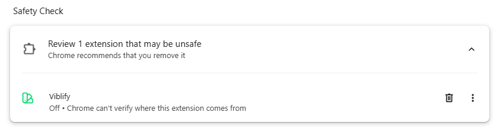
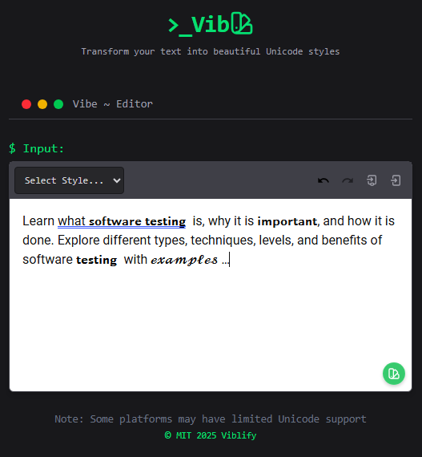

# Viblify - Transform Your Text with Style! 🎨✨


## Elevate Your Text Instantly

Viblify is the lightweight browser extension that brings professional Unicode styling to your fingertips. Transform plain text into **bold**, *italic*, 𝓈𝒸𝓇𝒾𝓅𝓉, and more—directly in any text field with a single click or keyboard shortcut.

## 🌟 Key Features

- **One-click styling** - 8+ Unicode text styles at your command
- **Works everywhere** - Twitter, LinkedIn, emails, forms, and more
- **Keyboard shortcuts** - Lightning-fast formatting (Ctrl+B, Ctrl+I, etc.)
- **Smart detection** - Button appears only when needed
- **Zero tracking** - Your text never leaves your browser

## 🚀 Installation Guide

### For Regular Users (.CRX Method)

1. [Download viblify.crx](./viblify.crx)
2. Visit `chrome://extensions` (Chrome) or `edge://extensions` (Edge)
3. Drag and drop the .crx file into the page
4. When you see:  
     
   Click "Add extension" - this is normal for self-hosted extensions
5. Confirm installation when prompted

### For Developers (Unpacked Method)

```bash
git clone https://github.com/petsamuel/viblify.git

or [Download](./viblify.zip) and unzip it
cd viblify

1. Visit `chrome://extensions` or `edge://extensions`
2. Enable "Developer mode" (top-right toggle)
3. Click "Load unpacked" and select the viblify folder
4. No warnings appear with this method
```

### Alternative Installation Options

#### Option 1: Using the .crx File

1. Download the `.crx` file from the [Download](./viblify.crx) section.
2. Open Chrome or Edge and go to `chrome://extensions/` (or `edge://extensions/`).
3. Drag the `./viblify.crx` file into the window.
4. **Note**: You'll see a warning: "This extension is not from [Chrome Web Store/known source]..." - this is expected for self-hosted extensions.
5. Click "Add Extension" to confirm - your data remains private.

#### Option 2: Using the ZIP (Developer Mode)

1. Download the ZIP from the [Download](./viblify.zip) section and unzip it.
2. Open Chrome/Edge and go to the extensions page.
3. Enable **Developer Mode** (top-right toggle).
4. Click **Load Unpacked** and select the unzipped `viblify` folder.
5. The extension will load without warnings.

## 🎮 How to Use

1. **Start typing** in any text field (3+ characters required)
2. **Click the Viblify button** (bottom-right corner)
3. **Select your style** from the popup menu
4. **Or use shortcuts**:
   - Bold: `Ctrl+B`
   - Italic: `Ctrl+I`
   - Script: `Ctrl+S`
   - More in the menu!



## 🏆 Supported Platforms

✓ Twitter (tweet composer)  
✓ LinkedIn (posts/comments)  
✓ Facebook (status updates)  
✓ All websites with text inputs  
✓ Any content-editable field  

## 🛠 Troubleshooting

If the extension gets disabled:

1. Go to `chrome://extensions` or `edge://extensions`
2. Find Viblify and click "Details"
3. Enable:
   - "Allow in incognito" (if needed)
   - "Allow access to file URLs" (for local documents)
4. Refresh your active tabs

## 🤝 Contributing

We welcome contributors! Here's how to help:

**Code Improvements:**

```bash
# 1. Fork and clone
git clone [viblify](https://github.com/Petsamuel/Viblify.git)
cd viblify

# 2. Install dev tools (optional)
npm install -g live-server

# 3. Make changes and test
live-server --port=3000
```

**Other Ways to Contribute:**

- Report bugs via [GitHub Issues]
- Suggest new features
- Improve documentation
- Share Viblify with friends!

## 📜 License

MIT Licensed - Free for personal and commercial use. See [LICENSE](LICENSE) for details.

## 📬 Contact

Have questions or ideas?  
🐦 [Tweet us Bieefilled]  
📧 [Email us @petsamuelgmail.com]  
💬 [Open a GitHub Issue]


**Pro Tip:** Combine styles for unique effects! Try `Ctrl+B` then `Ctrl+S` for **𝓫𝓸𝓵𝓭 𝓼𝓬𝓻𝓲𝓹𝓽** text.

[Get Viblify Now](./viblify.zip) and make your words stand out! 🚀

---

**Disclaimer:** This extension is not affiliated with or endorsed by any social media platform. Use at your own risk. Always check the latest privacy policies of the platforms you use.